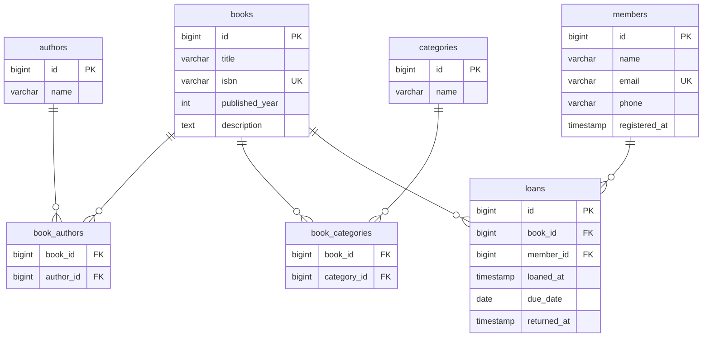

# データベース設計

## ER 図



## エンティティ定義

### books（書籍）

| カラム | 型 | 説明 |
|---|---|---|
| id | bigint | PK |
| title | varchar | タイトル |
| isbn | varchar | ISBN（一意） |
| published_year | int | 出版年 |
| description | text | 説明 |

### authors（著者）

| カラム | 型 | 説明 |
|---|---|---|
| id | bigint | PK |
| name | varchar | 著者名 |

### categories（カテゴリ）

| カラム | 型 | 説明 |
|---|---|---|
| id | bigint | PK |
| name | varchar | カテゴリ名 |

### members（会員）

| カラム | 型 | 説明 |
|---|---|---|
| id | bigint | PK |
| name | varchar | 氏名 |
| email | varchar | メールアドレス（一意） |
| phone | varchar | 電話番号 |
| registered_at | timestamp | 登録日時 |

### loans（貸出）

| カラム | 型 | 説明 |
|---|---|---|
| id | bigint | PK |
| book_id | bigint | FK → books |
| member_id | bigint | FK → members |
| loaned_at | timestamp | 貸出日時 |
| due_date | date | 返却期限 |
| returned_at | timestamp | 返却日時（null = 貸出中） |

## リレーション

| 関係 | 種別 | 説明 |
|---|---|---|
| books ↔ authors | 多対多 | book_authors で管理 |
| books ↔ categories | 多対多 | book_categories で管理 |
| books → loans | 一対多 | 返却後に再貸出可能 |
| members → loans | 一対多 | 会員は複数冊借りられる |

## ビジネスルール

- `loans.returned_at` が `null` の場合、当該書籍は貸出中
- `loans.due_date` を過ぎており `returned_at` が `null` の場合、延滞
- 貸出中の書籍は別の会員には貸し出せない
- 蔵書（BookCopy）は今後の拡張として予約

## マイグレーション構成（Flyway）

```
src/main/resources/db/migration/
├── V1__create_books.sql
├── V2__create_authors.sql
├── V3__create_categories.sql
├── V4__create_book_authors.sql
├── V5__create_book_categories.sql
├── V6__create_members.sql
└── V7__create_loans.sql
```
