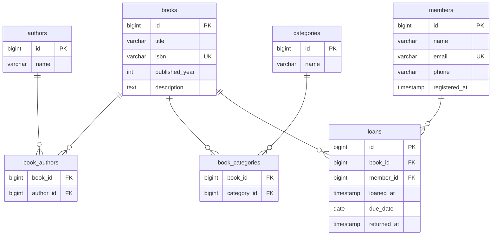

# 図書館管理システム 設計書

## 概要

Spring Boot を用いた図書館管理システムの REST API。
書籍・著者・カテゴリ・会員を管理し、貸出・返却のライフサイクルを扱う。

## 技術スタック

| 項目 | 内容 |
|---|---|
| 言語 | Java 25 |
| フレームワーク | Spring Boot 4.0.6 |
| ビルドツール | Gradle 9.5.1 |
| DB マイグレーション | Flyway |
| テスト | JUnit 5 / @WebMvcTest |
| CI | GitHub Actions |

## ER 図

## エンティティ定義

### books（書籍）

| カラム | 型 | 説明 |
|---|---|---|
| id | bigint | PK |
| title | varchar | タイトル |
| isbn | varchar | ISBN（一意） |
| published_year | int | 出版年 |
| description | text | 説明 |

### authors（著者）

| カラム | 型 | 説明 |
|---|---|---|
| id | bigint | PK |
| name | varchar | 著者名 |

### categories（カテゴリ）

| カラム | 型 | 説明 |
|---|---|---|
| id | bigint | PK |
| name | varchar | カテゴリ名 |

### members（会員）

| カラム | 型 | 説明 |
|---|---|---|
| id | bigint | PK |
| name | varchar | 氏名 |
| email | varchar | メールアドレス（一意） |
| phone | varchar | 電話番号 |
| registered_at | timestamp | 登録日時 |

### loans（貸出）

| カラム | 型 | 説明 |
|---|---|---|
| id | bigint | PK |
| book_id | bigint | FK → books |
| member_id | bigint | FK → members |
| loaned_at | timestamp | 貸出日時 |
| due_date | date | 返却期限 |
| returned_at | timestamp | 返却日時（null = 貸出中） |

## リレーション

| 関係 | 種別 | 説明 |
|---|---|---|
| books ↔ authors | 多対多 | book_authors で管理 |
| books ↔ categories | 多対多 | book_categories で管理 |
| books → loans | 一対多 | 返却後に再貸出可能 |
| members → loans | 一対多 | 会員は複数冊借りられる |

## ビジネスルール

- `loans.returned_at` が `null` の場合、当該書籍は貸出中
- `loans.due_date` を過ぎており `returned_at` が `null` の場合、延滞
- 貸出中の書籍は別の会員には貸し出せない
- 蔵書（BookCopy）は今後の拡張として予約

## 計画中の API エンドポイント

### 書籍

| メソッド | パス | 説明 |
|---|---|---|
| GET | /books | 一覧取得 |
| GET | /books/{id} | 詳細取得 |
| POST | /books | 登録 |
| PUT | /books/{id} | 更新 |
| DELETE | /books/{id} | 削除 |

### 著者

| メソッド | パス | 説明 |
|---|---|---|
| GET | /authors | 一覧取得 |
| GET | /authors/{id} | 詳細取得 |
| POST | /authors | 登録 |
| PUT | /authors/{id} | 更新 |
| DELETE | /authors/{id} | 削除 |

### カテゴリ

| メソッド | パス | 説明 |
|---|---|---|
| GET | /categories | 一覧取得 |
| POST | /categories | 登録 |
| DELETE | /categories/{id} | 削除 |

### 会員

| メソッド | パス | 説明 |
|---|---|---|
| GET | /members | 一覧取得 |
| GET | /members/{id} | 詳細取得 |
| POST | /members | 登録 |
| PUT | /members/{id} | 更新 |
| DELETE | /members/{id} | 削除 |

### 貸出

| メソッド | パス | 説明 |
|---|---|---|
| POST | /loans | 貸出開始 |
| PATCH | /loans/{id}/return | 返却 |
| GET | /loans | 貸出一覧（フィルタ可） |
| GET | /loans/overdue | 延滞一覧 |

## 開発ロードマップ

1. **DB 基盤** — Spring Data JPA + Flyway + H2（開発）/ PostgreSQL（本番）
2. **書籍 CRUD** — 最初のエンティティ実装
3. **著者・カテゴリ CRUD** — 多対多リレーション
4. **会員 CRUD**
5. **貸出・返却機能** — ビジネスロジック実装
6. **バリデーション** — 入力チェック・エラーハンドリング
7. **OpenAPI（Swagger）** — API 仕様書の自動生成
